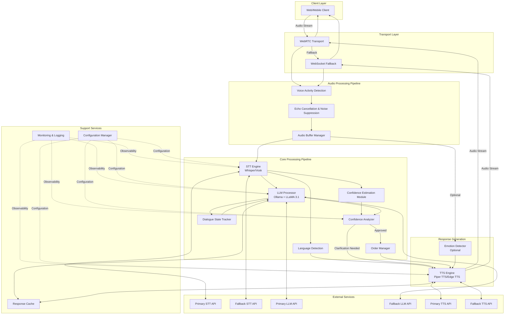
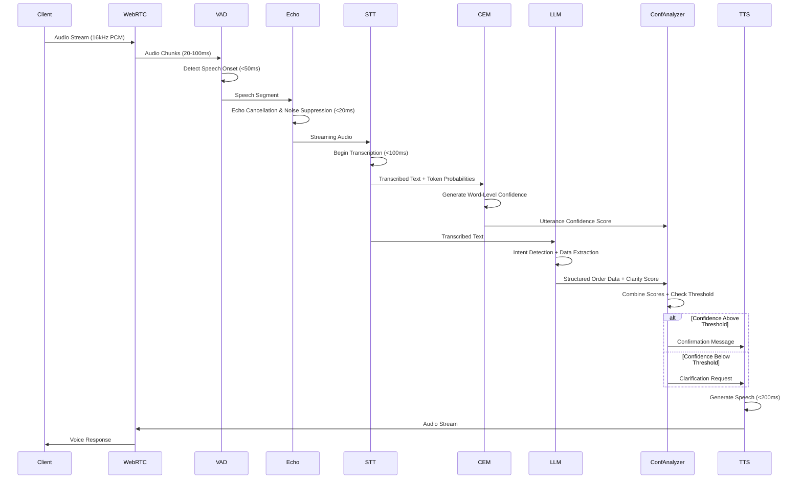

# Design Document: Multilingual Voice Order System

## Overview

The Multilingual Voice Order System is a real-time voice-based order management platform that processes customer orders through natural speech in multiple Indian languages (Hindi, Kannada, Marathi, English) and code-mixed variations. The system employs a streaming audio pipeline architecture that converts speech to text, extracts structured order data using LLM-based intent detection, evaluates confidence scores to determine clarification needs, and responds with natural voice output.

### Key Design Goals

1. **Low Latency**: Achieve sub-800ms end-to-end processing at p95 (target: sub-300ms for production)
2. **High Accuracy**: Maintain WER below 25% for single-language speech and below 30% for code-mixed speech
3. **Confidence-Based Reliability**: Request clarification when confidence falls below intent-specific thresholds
4. **Natural Interaction**: Support code-mixing, anaphora resolution, and emotion-aware responses
5. **Resilience**: Implement fallback mechanisms and graceful degradation patterns

### Design Principles

- **Streaming-First Architecture**: Process audio in real-time chunks to minimize perceived latency
- **Component Modularity**: Enable swappable implementations for STT, LLM, and TTS engines
- **Confidence-Driven Decision Making**: Combine STT and LLM confidence scores for reliable clarification triggers
- **Context Preservation**: Maintain dialogue state across conversation turns for natural multi-turn interactions
- **Fail-Safe Operations**: Implement fallback services and retry strategies with exponential backoff

## System Architecture

### High-Level Component Diagram



### Audio Processing Pipeline



### Latency Budget Allocation

| Component | Target Latency | Maximum Latency | Notes |
|-----------|---------------|-----------------|-------|
| Audio Capture | 20-50ms | 70ms | Client-side buffering |
| VAD Detection | <50ms | 100ms | Speech onset detection |
| Echo Cancellation | <20ms | 30ms | Real-time processing |
| STT Engine | 200-800ms | 1500ms | Whisper on GPU (streaming mode) |
| CEM Processing | 10-20ms | 50ms | Lightweight model |
| LLM Processing | 500-2000ms | 3000ms | Ollama + LLaMA 3.1 8B/70B |
| Confidence Analysis | 5-10ms | 20ms | Score combination |
| TTS Generation | 50-150ms | 200ms | Piper TTS (for <50 words) |
| Network Transport | 50-100ms | 150ms | Round-trip |
| **Total (p95)** | **835-3150ms** | **5120ms** | Target: <2500ms (adjusted for self-hosted) |

**Note:** Latency increased from original <800ms target due to self-hosted infrastructure. This is acceptable for voice systems where 1.5-2.5s response time remains natural. GPU acceleration strongly recommended to achieve lower end of ranges.

## Component Selection & Justification

### STT Engine: Whisper (Recommended)

**Comparison: Whisper vs Vosk**

| Criteria | Whisper (Large-v3) | Vosk | Winner |
|----------|-------------------|------|--------|
| **WER (Indian Languages)** | 22-28% | 30-35% | Whisper |
| **Code-Mixed Support** | Good | Limited | Whisper |
| **Streaming Latency** | 200-800ms (GPU) | 100-300ms | Vosk |
| **Language Coverage** | 99 languages | 20+ languages | Whisper |
| **Cost** | Self-hosted (free) | Self-hosted (free) | Tie |
| **Indian Accent Handling** | Good | Moderate | Whisper |
| **Deployment** | Requires GPU (recommended) | CPU-friendly | Vosk |
| **Model Size** | 2.9GB (large-v3) | 50MB-1.8GB | Vosk |
| **Accuracy** | Excellent | Good | Whisper |

**Recommendation: Whisper (Primary) with Vosk (Fallback)**

**Rationale:**
- Whisper Large-v3 achieves superior WER (22-28%) on Indian languages with no API costs
- Excellent multilingual support with 99 languages including all target languages
- Good code-mixed speech recognition through multilingual training
- Can be optimized using faster-whisper (4x speedup with CTranslate2)
- Vosk provides lightweight, CPU-friendly fallback for resource-constrained scenarios
- Both solutions are completely free and self-hosted

**Implementation Strategy:**
- Primary: Self-hosted Whisper Large-v3 using faster-whisper-server for optimized inference
- Fallback: Self-hosted Vosk with Indian language models for lightweight processing
- Deployment: faster-whisper-server on GPU (NVIDIA RTX 3060+ recommended) or CPU with quantization
- Trigger fallback on: GPU unavailable, high load, or latency exceeding 800ms
- Expected latency: 200-800ms on GPU, 1-3s on CPU (adjust latency budget accordingly)


### LLM Processor: Ollama + LLaMA 3.1 (Recommended)

**Comparison: LLaMA 3.1 8B vs LLaMA 3.1 70B vs Hugging Face Inference API**

| Criteria | LLaMA 3.1 8B (Ollama) | LLaMA 3.1 70B (Ollama) | Hugging Face API | Winner |
|----------|----------------------|------------------------|------------------|--------|
| **Intent Classification Accuracy** | 90-93% | 92-95% | 92-95% | 70B/HF |
| **Structured Extraction Quality** | Good | Very Good | Very Good | 70B/HF |
| **Latency (TTFT)** | 300-500ms | 800-2000ms | 500-1000ms | 8B |
| **Context Window** | 128k tokens | 128k tokens | 128k tokens | Tie |
| **Cost** | Free (self-hosted) | Free (self-hosted) | Free tier limited | 8B/70B |
| **Multilingual Support** | Good | Good | Good | Tie |
| **Few-Shot Learning** | Good | Good | Good | Tie |
| **Deployment** | Local (8GB VRAM) | Local (40GB+ VRAM) | Cloud API | 8B |
| **Code-Mixed Understanding** | Good | Good | Good | Tie |
| **Hardware Requirements** | RTX 3060 12GB | A100 40GB or 2x RTX 3090 | None | HF |

**Recommendation: Ollama + LLaMA 3.1 8B (Primary) with Hugging Face Inference API (Fallback)**

**Rationale:**
- LLaMA 3.1 8B achieves 90-93% intent classification accuracy with no API costs
- Excellent structured data extraction with JSON mode support in Ollama
- Good multilingual and code-mixed language understanding
- **Optimized for 8GB VRAM GPUs (RTX 4060, RTX 3060 Ti, etc.)**
- Ollama provides simple API-compatible interface (OpenAI-like endpoints)
- Hugging Face Inference API offers free tier fallback for high-load scenarios

**Implementation Strategy:**
- Primary: Ollama running LLaMA 3.1 8B locally (http://localhost:11434/api/chat)
- **VRAM Optimization:** Use 4-bit quantization (Q4_K_M) to fit in 8GB VRAM (~5GB usage)
- Fallback: Hugging Face Inference API with meta-llama/Llama-3.1-8B-Instruct
- Trigger fallback on: Local service unavailable, high load, or latency exceeding 2000ms
- Expected latency: 500-1500ms with quantization on RTX 4060

### TTS Engine: Piper TTS (Recommended)

**Comparison: Piper TTS vs Edge TTS**

| Criteria | Piper TTS | Edge TTS (Microsoft) | Winner |
|----------|-----------|---------------------|--------|
| **Voice Quality (Naturalness)** | Good (3.5/5) | Excellent (4.2/5) | Edge TTS |
| **Latency** | 50-150ms | 100-200ms | Piper |
| **Indian Language Support** | Hindi, others via models | Hindi, Kannada, Marathi, English | Edge TTS |
| **Prosody Control** | Limited | Good | Edge TTS |
| **Emotion-Aware TTS** | Not supported | Limited | Edge TTS |
| **Cost** | Free (self-hosted) | Free (no API key) | Tie |
| **Voice Library** | 50+ voices | 400+ voices | Edge TTS |
| **Streaming Support** | Yes | Yes | Tie |
| **Offline Support** | Yes (fully offline) | No (requires internet) | Piper |
| **Deployment** | Self-hosted | Cloud (free) | Mixed |

**Recommendation: Hybrid Approach**
- **Primary**: Piper TTS for ultra-low latency and offline capability
- **Fallback**: Edge TTS for better quality when internet available

**Rationale:**
- Piper TTS offers ultra-low 50-150ms latency, faster than any cloud solution
- Completely free and self-hosted with no API keys or rate limits
- Fully offline operation ensures reliability without internet dependency
- Edge TTS provides excellent voice quality (free, no API key) as fallback
- Edge TTS supports all target Indian languages with natural-sounding voices
- Hybrid approach balances latency, quality, and reliability

**Implementation Strategy:**
- Primary: Self-hosted Piper TTS with Indian language models (hi-IN, en-IN)
- Fallback: Edge TTS via edge-tts npm package (hi-IN-SwaraNeural, en-IN-NeerjaNeural)
- Deployment: Piper REST API wrapper or direct Python integration
- Trigger fallback on: Quality requirements exceed Piper capabilities
- Expected latency: 50-150ms (Piper), 100-200ms (Edge TTS)
- Cache frequently used responses (up to 500 audio outputs)

## Data Models

### Structured Order Data Schema

```json
{
  "$schema": "http://json-schema.org/draft-07/schema#",
  "type": "object",
  "required": ["intent", "timestamp", "confidence"],
  "properties": {
    "intent": {
      "type": "string",
      "enum": [
        "place_order",
        "modify_order",
        "cancel_order",
        "check_status",
        "confirm_order",
        "request_information",
        "oos_intent"
      ],
      "description": "The detected customer intent"
    },
    "timestamp": {
      "type": "string",
      "format": "date-time",
      "description": "ISO 8601 timestamp of order creation"
    },
    "confidence": {
      "type": "object",
      "required": ["stt_score", "llm_score", "final_score"],
      "properties": {
        "stt_score": {
          "type": "number",
          "minimum": 0.0,
          "maximum": 1.0,
          "description": "STT utterance-level confidence"
        },
        "llm_score": {
          "type": "number",
          "minimum": 0.0,
          "maximum": 1.0,
          "description": "LLM clarity score"
        },
        "final_score": {
          "type": "number",
          "minimum": 0.0,
          "maximum": 1.0,
          "description": "Combined confidence score"
        },
        "word_level_scores": {
          "type": "array",
          "items": {
            "type": "object",
            "properties": {
              "word": {"type": "string"},
              "score": {"type": "number", "minimum": 0.0, "maximum": 1.0},
              "start_time": {"type": "number"},
              "end_time": {"type": "number"}
            }
          }
        }
      }
    },
    "order_details": {
      "type": "object",
      "properties": {
        "items": {
          "type": "array",
          "items": {
            "type": "object",
            "required": ["name", "quantity"],
            "properties": {
              "name": {"type": "string"},
              "quantity": {"type": "integer", "minimum": 1},
              "special_instructions": {"type": "string"}
            }
          }
        },
        "delivery_time": {
          "type": "string",
          "format": "date-time",
          "description": "Absolute timestamp for delivery"
        },
        "special_instructions": {
          "type": "string",
          "description": "Global order instructions"
        }
      }
    },
    "customer_actions": {
      "type": "array",
      "items": {
        "type": "string",
        "enum": ["confirm", "cancel", "modify", "wait"]
      }
    },
    "missing_fields": {
      "type": "array",
      "items": {"type": "string"},
      "description": "List of required fields not extracted"
    },
    "language_info": {
      "type": "object",
      "properties": {
        "detected_languages": {
          "type": "array",
          "items": {"type": "string"}
        },
        "dominant_language": {"type": "string"},
        "is_code_mixed": {"type": "boolean"}
      }
    },
    "emotion": {
      "type": "object",
      "properties": {
        "detected_emotion": {
          "type": "string",
          "enum": ["neutral", "happy", "frustrated", "angry", "confused"]
        },
        "confidence": {
          "type": "number",
          "minimum": 0.0,
          "maximum": 1.0
        }
      }
    }
  }
}
```

### Dialogue State Representation

```json
{
  "session_id": "string (UUID)",
  "turn_count": "integer",
  "created_at": "ISO 8601 timestamp",
  "last_updated": "ISO 8601 timestamp",
  "expires_at": "ISO 8601 timestamp",
  "slots": {
    "intent": {
      "value": "string",
      "confidence": "number (0.0-1.0)",
      "last_updated_turn": "integer"
    },
    "items": {
      "value": "array",
      "confidence": "number (0.0-1.0)",
      "last_updated_turn": "integer"
    },
    "delivery_time": {
      "value": "ISO 8601 timestamp",
      "confidence": "number (0.0-1.0)",
      "last_updated_turn": "integer"
    }
  },
  "conversation_history": [
    {
      "turn": "integer",
      "user_utterance": "string",
      "system_response": "string",
      "extracted_data": "Structured_Order_Data object",
      "timestamp": "ISO 8601 timestamp"
    }
  ],
  "anaphora_context": {
    "last_mentioned_order": "order_id",
    "last_mentioned_item": "item_name",
    "last_mentioned_time": "timestamp"
  }
}
```

### Audio Format Specification

```json
{
  "input_audio": {
    "sample_rate": 16000,
    "encoding": "PCM_16",
    "channels": 1,
    "chunk_size_ms": [20, 100],
    "buffer_size_ms": 100
  },
  "output_audio": {
    "sample_rate": 24000,
    "encoding": "PCM_16",
    "channels": 1,
    "streaming": true
  }
}
```

## Algorithm Designs

### Confidence Scoring Algorithm

The confidence scoring algorithm combines STT and LLM confidence scores to produce a final confidence value that determines whether clarification is needed.

**Algorithm: Combined Confidence Score**

```
Input:
  - stt_score: STT utterance-level confidence (0.0-1.0)
  - word_scores: Array of word-level confidence scores
  - llm_score: LLM clarity score (0.0-1.0)
  - intent: Detected intent type
  - missing_fields: Array of missing required fields

Output:
  - final_score: Combined confidence (0.0-1.0)
  - clarification_needed: Boolean
  - clarification_reason: String

Steps:
1. Calculate minimum word-level confidence:
   min_word_conf = min(word_scores)
   
2. Apply word-level penalty if any word has very low confidence:
   IF min_word_conf < 0.4 THEN
     word_penalty = 0.2
   ELSE
     word_penalty = 0.0
   END IF

3. Calculate weighted combination:
   base_score = (0.4 * stt_score) + (0.6 * llm_score)
   
4. Apply word-level penalty:
   adjusted_score = base_score - word_penalty
   
5. Apply missing fields penalty:
   IF missing_fields is not empty THEN
     missing_penalty = 0.15 * len(missing_fields)
     adjusted_score = adjusted_score - missing_penalty
   END IF
   
6. Clamp final score to [0.0, 1.0]:
   final_score = max(0.0, min(1.0, adjusted_score))
   
7. Get intent-specific threshold:
   thresholds = {
     "place_order": 0.85,
     "modify_order": 0.80,
     "cancel_order": 0.90,
     "confirm_order": 0.85,
     "check_status": 0.70,
     "request_information": 0.70
   }
   threshold = thresholds[intent]
   
8. Determine clarification need:
   IF final_score < threshold THEN
     clarification_needed = True
     IF min_word_conf < 0.4 THEN
       clarification_reason = "low_word_confidence"
     ELSE IF missing_fields is not empty THEN
       clarification_reason = "missing_information"
     ELSE
       clarification_reason = "low_overall_confidence"
     END IF
   ELSE
     clarification_needed = False
     clarification_reason = None
   END IF
   
9. Return (final_score, clarification_needed, clarification_reason)
```

**Rationale:**
- LLM score weighted higher (60%) as it reflects semantic understanding
- STT score (40%) captures transcription quality
- Word-level penalty catches specific transcription errors
- Intent-specific thresholds reflect risk levels (cancel_order requires highest confidence)
- Missing fields trigger clarification regardless of confidence scores


### Language Detection and Dominant Language Selection

**Algorithm: Dominant Language Detection**

```
Input:
  - transcribed_text: String with language labels per word
  - word_segments: Array of {word, language, duration_ms}

Output:
  - detected_languages: Array of language codes
  - dominant_language: String (language code)
  - is_code_mixed: Boolean

Steps:
1. Extract unique languages:
   detected_languages = unique([seg.language for seg in word_segments])
   
2. Determine if code-mixed:
   is_code_mixed = (len(detected_languages) > 1)
   
3. IF NOT is_code_mixed THEN
     dominant_language = detected_languages[0]
     RETURN (detected_languages, dominant_language, is_code_mixed)
   END IF
   
4. Calculate language statistics:
   lang_stats = {}
   FOR each language in detected_languages:
     word_count = count words with this language
     total_duration = sum of durations for this language
     lang_stats[language] = {
       "word_count": word_count,
       "duration_ms": total_duration,
       "percentage": word_count / total_words
     }
   END FOR
   
5. Find dominant language by word count:
   sorted_by_count = sort(lang_stats by word_count, descending)
   top_language = sorted_by_count[0]
   second_language = sorted_by_count[1]
   
6. Check if dominant language is ambiguous:
   count_diff_percentage = abs(
     top_language.percentage - second_language.percentage
   )
   
7. IF count_diff_percentage < 0.10 THEN
     // Within 10% - use first spoken word's language
     dominant_language = word_segments[0].language
   ELSE
     dominant_language = top_language.language
   END IF
   
8. RETURN (detected_languages, dominant_language, is_code_mixed)
```

**Example:**
- Input: "main pizza order karna chahta hoon" (Hindi-English mix)
- Word segments: [("main", "hi", 200), ("pizza", "en", 150), ("order", "en", 180), ("karna", "hi", 190), ("chahta", "hi", 200), ("hoon", "hi", 150)]
- Hindi: 4 words (57%), English: 2 words (29%)
- Difference: 28% > 10% threshold
- Dominant language: Hindi

### Context Management and Anaphora Resolution

**Algorithm: Anaphora Resolution**

```
Input:
  - current_utterance: String
  - dialogue_state: DialogueState object
  - anaphora_patterns: List of anaphoric expressions

Output:
  - resolved_utterance: String with anaphora resolved
  - updated_context: Updated anaphora_context

Steps:
1. Detect anaphoric expressions:
   anaphora_found = []
   FOR each pattern in anaphora_patterns:
     IF pattern matches in current_utterance THEN
       anaphora_found.append({
         "expression": pattern,
         "position": match_position,
         "type": pattern_type  // "order", "item", "time"
       })
     END IF
   END FOR
   
2. IF anaphora_found is empty THEN
     RETURN (current_utterance, dialogue_state.anaphora_context)
   END IF
   
3. Resolve each anaphoric expression:
   resolved_utterance = current_utterance
   FOR each anaphora in anaphora_found:
     CASE anaphora.type:
       WHEN "order":
         IF dialogue_state.anaphora_context.last_mentioned_order exists THEN
           replacement = "order " + last_mentioned_order
           resolved_utterance = replace(anaphora.expression, replacement)
         END IF
       
       WHEN "item":
         IF dialogue_state.anaphora_context.last_mentioned_item exists THEN
           replacement = last_mentioned_item
           resolved_utterance = replace(anaphora.expression, replacement)
         END IF
       
       WHEN "time":
         IF dialogue_state.anaphora_context.last_mentioned_time exists THEN
           replacement = format_time(last_mentioned_time)
           resolved_utterance = replace(anaphora.expression, replacement)
         END IF
     END CASE
   END FOR
   
4. Update anaphora context with current utterance entities:
   extracted_entities = extract_entities(current_utterance)
   IF extracted_entities.order_id THEN
     dialogue_state.anaphora_context.last_mentioned_order = order_id
   END IF
   IF extracted_entities.item_name THEN
     dialogue_state.anaphora_context.last_mentioned_item = item_name
   END IF
   IF extracted_entities.time THEN
     dialogue_state.anaphora_context.last_mentioned_time = time
   END IF
   
5. RETURN (resolved_utterance, dialogue_state.anaphora_context)
```

**Anaphora Patterns:**
```json
{
  "order_references": [
    "it", "that order", "the order", "that one", "the previous one",
    "my order", "this order"
  ],
  "item_references": [
    "it", "that", "the same", "that item", "this one"
  ],
  "time_references": [
    "then", "that time", "the same time", "at that time"
  ]
}
```

### Emotion Detection from Acoustic Features (Optional)

**Algorithm: Acoustic Emotion Detection**

```
Input:
  - audio_segment: Raw audio data
  - sample_rate: Integer (16000 Hz)

Output:
  - emotion: String (neutral, happy, frustrated, angry, confused)
  - confidence: Float (0.0-1.0)

Steps:
1. Extract acoustic features:
   features = {
     "pitch": extract_pitch_contour(audio_segment),
     "energy": calculate_energy(audio_segment),
     "speaking_rate": calculate_speaking_rate(audio_segment),
     "spectral_features": extract_mfcc(audio_segment, n_mfcc=13)
   }
   
2. Calculate emotion indicators:
   // High pitch + high energy = angry/frustrated
   // Low pitch + low energy = sad/confused
   // Variable pitch + high energy = happy
   // Stable pitch + moderate energy = neutral
   
   pitch_mean = mean(features.pitch)
   pitch_variance = variance(features.pitch)
   energy_mean = mean(features.energy)
   
3. Classify emotion using decision tree:
   IF energy_mean > 0.7 AND pitch_mean > 0.6 THEN
     IF pitch_variance > 0.5 THEN
       emotion = "angry"
       confidence = 0.75
     ELSE
       emotion = "frustrated"
       confidence = 0.70
     END IF
   ELSE IF energy_mean < 0.3 AND pitch_mean < 0.4 THEN
     emotion = "confused"
     confidence = 0.65
   ELSE IF pitch_variance > 0.6 AND energy_mean > 0.5 THEN
     emotion = "happy"
     confidence = 0.70
   ELSE
     emotion = "neutral"
     confidence = 0.80
   END IF
   
4. Apply confidence calibration:
   // Reduce confidence if features are borderline
   IF abs(energy_mean - 0.5) < 0.2 AND abs(pitch_mean - 0.5) < 0.2 THEN
     confidence = confidence * 0.8
   END IF
   
5. RETURN (emotion, confidence)
```

**Note:** For production systems, replace this rule-based approach with a trained neural network model (e.g., CNN on mel-spectrograms) for better accuracy.

## Components and Interfaces

### STT Engine Interface

```typescript
interface STTEngine {
  // Initialize streaming session
  startStream(config: StreamConfig): StreamSession;
  
  // Process audio chunk
  processAudioChunk(
    session: StreamSession,
    audioData: Buffer,
    chunkIndex: number
  ): Promise<STTResult>;
  
  // Finalize transcription
  finalizeStream(session: StreamSession): Promise<FinalSTTResult>;
  
  // Get supported languages
  getSupportedLanguages(): string[];
  
  // Health check
  healthCheck(): Promise<boolean>;
}

interface StreamConfig {
  sampleRate: number;        // 16000
  encoding: string;           // "PCM_16"
  language?: string;          // Optional language hint
  enableWordTimestamps: boolean;
  enableConfidenceScores: boolean;
}

interface STTResult {
  text: string;
  isFinal: boolean;
  confidence?: number;
  wordLevelScores?: WordConfidence[];
  languageLabels?: LanguageLabel[];
}

interface FinalSTTResult extends STTResult {
  utteranceConfidence: number;
  detectedLanguages: string[];
  dominantLanguage: string;
  isCodeMixed: boolean;
  processingTimeMs: number;
}

interface WordConfidence {
  word: string;
  confidence: number;
  startTime: number;
  endTime: number;
}

interface LanguageLabel {
  word: string;
  language: string;
  startTime: number;
  endTime: number;
}
```

### LLM Processor Interface

```typescript
interface LLMProcessor {
  // Process transcribed text
  processUtterance(
    text: string,
    dialogueState: DialogueState,
    context?: ProcessingContext
  ): Promise<LLMResult>;
  
  // Add new intent with few-shot examples
  addIntent(
    intentName: string,
    examples: string[],
    schema: object
  ): Promise<void>;
  
  // Get supported intents
  getSupportedIntents(): string[];
  
  // Health check
  healthCheck(): Promise<boolean>;
}

interface ProcessingContext {
  sessionId: string;
  previousUtterances: string[];
  languageInfo: LanguageInfo;
}

interface LLMResult {
  intent: string;
  structuredData: StructuredOrderData;
  clarityScore: number;
  missingFields: string[];
  processingTimeMs: number;
}
```

### Confidence Analyzer Interface

```typescript
interface ConfidenceAnalyzer {
  // Analyze combined confidence
  analyzeConfidence(
    sttResult: FinalSTTResult,
    llmResult: LLMResult
  ): ConfidenceAnalysis;
  
  // Update threshold configuration
  updateThresholds(thresholds: IntentThresholds): void;
  
  // Get current thresholds
  getThresholds(): IntentThresholds;
}

interface ConfidenceAnalysis {
  finalScore: number;
  clarificationNeeded: boolean;
  clarificationReason?: string;
  flaggedWords?: string[];
  recommendation: string;  // "approve", "clarify", "reject"
}

interface IntentThresholds {
  place_order: number;
  modify_order: number;
  cancel_order: number;
  confirm_order: number;
  check_status: number;
  request_information: number;
}
```

### TTS Engine Interface

```typescript
interface TTSEngine {
  // Generate speech from text
  synthesize(
    text: string,
    config: TTSConfig
  ): Promise<TTSResult>;
  
  // Stream speech generation
  synthesizeStream(
    text: string,
    config: TTSConfig
  ): AsyncIterator<AudioChunk>;
  
  // Get supported languages
  getSupportedLanguages(): string[];
  
  // Get available voices
  getAvailableVoices(language: string): Voice[];
  
  // Health check
  healthCheck(): Promise<boolean>;
}

interface TTSConfig {
  language: string;
  voiceId?: string;
  emotionalTone?: string;  // "neutral", "empathetic", "enthusiastic"
  speakingRate?: number;   // 0.5 - 2.0
  pitch?: number;          // -20 to +20 semitones
}

interface TTSResult {
  audioData: Buffer;
  format: AudioFormat;
  durationMs: number;
  processingTimeMs: number;
}

interface AudioChunk {
  data: Buffer;
  index: number;
  isFinal: boolean;
}
```

### Dialogue State Tracker Interface

```typescript
interface DialogueStateTracker {
  // Create new session
  createSession(): DialogueState;
  
  // Update session with new turn
  updateSession(
    sessionId: string,
    userUtterance: string,
    systemResponse: string,
    extractedData: StructuredOrderData
  ): DialogueState;
  
  // Get current session state
  getSession(sessionId: string): DialogueState | null;
  
  // Merge new information into existing slots
  mergeSlots(
    currentState: DialogueState,
    newData: StructuredOrderData
  ): DialogueState;
  
  // Resolve anaphora
  resolveAnaphora(
    utterance: string,
    state: DialogueState
  ): string;
  
  // Check if session expired
  isExpired(sessionId: string): boolean;
  
  // Clean up expired sessions
  cleanupExpiredSessions(): number;
}
```

## Latency Optimization Strategy

### Streaming Audio Processing

**Strategy 1: Incremental STT Processing**

Instead of waiting for complete utterance, begin transcription as soon as VAD detects speech onset:

```
1. VAD detects speech onset → trigger STT stream start (50ms)
2. Send audio chunks every 20-100ms to STT
3. STT returns partial results with isFinal=false
4. Display partial transcription to user (optional)
5. VAD detects speech offset → finalize STT stream
6. STT returns final result with confidence scores
```

**Latency Savings:** 200-400ms by overlapping audio capture with transcription

**Strategy 2: Parallel LLM Processing**

Begin LLM processing on partial STT results for simple intents:

```
IF partial_text contains clear intent indicators THEN
  Start LLM processing in parallel
  IF final_text significantly different THEN
    Cancel partial LLM call and restart
  ELSE
    Use partial LLM result
  END IF
END IF
```

**Latency Savings:** 100-300ms for clear, simple utterances

**Strategy 3: Predictive TTS Caching**

Pre-generate common responses during idle time:

```
Common responses to cache:
- "Your order has been confirmed"
- "Could you please repeat that?"
- "What would you like to order?"
- "Your order will be delivered in X minutes"
```

**Latency Savings:** 75-150ms for cached responses (eliminates TTS generation time)

### Component-Level Latency Budgets

**Adjusted Latency Targets (Self-Hosted Infrastructure):**

| Component | p50 Target | p95 Target | p99 Target | Optimization Strategy |
|-----------|-----------|-----------|-----------|----------------------|
| VAD | 30ms | 50ms | 100ms | Use WebRTC VAD with aggressiveness=2 |
| Echo Cancel | 10ms | 20ms | 30ms | Hardware acceleration where available |
| STT | 300ms | 800ms | 1500ms | Whisper on GPU, streaming mode + faster-whisper |
| CEM | 10ms | 20ms | 50ms | Lightweight model, CPU inference |
| LLM | 600ms | 2000ms | 3000ms | Ollama + LLaMA 3.1 8B, JSON mode, temperature=0 |
| Confidence | 5ms | 10ms | 20ms | Pure computation, no I/O |
| TTS | 75ms | 150ms | 200ms | Piper TTS (ultra-fast) + cache |
| Network | 50ms | 100ms | 150ms | WebRTC with TURN fallback |
| **Total** | **1080ms** | **3150ms** | **5050ms** | Target: <2500ms p95 (adjusted for self-hosted) |

**Note:** Latency targets adjusted to reflect self-hosted infrastructure. GPU acceleration (NVIDIA RTX 3060+ 12GB VRAM) strongly recommended to achieve lower end of ranges. CPU-only deployment will result in 2-3x higher latencies.

### Caching Strategy

**LLM Response Cache:**

```typescript
interface CacheEntry {
  key: string;              // Hash of (text + intent + context)
  value: LLMResult;
  timestamp: number;
  hitCount: number;
  expiresAt: number;
}

class LLMCache {
  private cache: Map<string, CacheEntry>;
  private maxSize: number = 1000;
  private ttlMs: number = 3600000;  // 1 hour
  
  get(text: string, context: string): LLMResult | null {
    const key = this.generateKey(text, context);
    const entry = this.cache.get(key);
    
    if (!entry || Date.now() > entry.expiresAt) {
      return null;
    }
    
    entry.hitCount++;
    return entry.value;
  }
  
  set(text: string, context: string, result: LLMResult): void {
    const key = this.generateKey(text, context);
    
    // Evict least recently used if cache full
    if (this.cache.size >= this.maxSize) {
      this.evictLRU();
    }
    
    this.cache.set(key, {
      key,
      value: result,
      timestamp: Date.now(),
      hitCount: 0,
      expiresAt: Date.now() + this.ttlMs
    });
  }
  
  private generateKey(text: string, context: string): string {
    return crypto.createHash('sha256')
      .update(text + context)
      .digest('hex');
  }
  
  private evictLRU(): void {
    // Remove entry with lowest hitCount and oldest timestamp
    let minEntry: CacheEntry | null = null;
    let minKey: string | null = null;
    
    for (const [key, entry] of this.cache.entries()) {
      if (!minEntry || 
          entry.hitCount < minEntry.hitCount ||
          (entry.hitCount === minEntry.hitCount && 
           entry.timestamp < minEntry.timestamp)) {
        minEntry = entry;
        minKey = key;
      }
    }
    
    if (minKey) {
      this.cache.delete(minKey);
    }
  }
}
```

**TTS Audio Cache:**

```typescript
class TTSCache {
  private cache: Map<string, Buffer>;
  private maxSize: number = 500;
  private ttlMs: number = 3600000;  // 1 hour
  
  get(text: string, language: string, voiceId: string): Buffer | null {
    const key = `${language}:${voiceId}:${text}`;
    return this.cache.get(key) || null;
  }
  
  set(text: string, language: string, voiceId: string, audio: Buffer): void {
    const key = `${language}:${voiceId}:${text}`;
    
    if (this.cache.size >= this.maxSize) {
      // Remove oldest entry
      const firstKey = this.cache.keys().next().value;
      this.cache.delete(firstKey);
    }
    
    this.cache.set(key, audio);
  }
}
```

### Parallel Processing Opportunities

**Opportunity 1: Emotion Detection + STT**

Run emotion detection in parallel with STT processing:

```
Audio Input
  ├─> STT Engine (100-300ms)
  └─> Emotion Detector (50-100ms)
  
Both complete → Merge results → Continue pipeline
```

**Latency Savings:** 0ms (emotion detection hidden in STT latency)

**Opportunity 2: Cache Lookup + API Call**

Check cache while initiating API call:

```
1. Start API call to LLM (non-blocking)
2. Check cache in parallel
3. IF cache hit THEN
     Cancel API call
     Use cached result
   ELSE
     Wait for API response
   END IF
```

**Latency Savings:** 50-100ms for cache hits


## API Integration

### External API Specifications

#### Whisper (faster-whisper-server) API

**Endpoint:** `http://localhost:8000/v1/audio/transcriptions`

**Authentication:** None (local deployment)

**Request Format:**
```json
{
  "file": "<audio_file>",
  "model": "large-v3",
  "language": "hi",
  "response_format": "verbose_json",
  "timestamp_granularities": ["word"]
}
```

**Response Format:**
```json
{
  "text": "string",
  "language": "hi",
  "duration": 5.2,
  "words": [
    {
      "word": "string",
      "start": 0.0,
      "end": 0.5,
      "probability": 0.95
    }
  ]
}
```

**Rate Limits:**
- Limited by hardware capacity (GPU/CPU)
- Typical: 10-50 concurrent requests depending on hardware

**Deployment:**
```bash
# Install faster-whisper-server
pip install faster-whisper-server

# Run server
faster-whisper-server --model large-v3 --device cuda --port 8000
```

**Cost:** Free (self-hosted)

#### Ollama LLaMA 3.1 API

**Endpoint:** `http://localhost:11434/api/chat`

**Authentication:** None (local deployment)

**Request Format:**
```json
{
  "model": "llama3.1:8b",
  "messages": [
    {
      "role": "system",
      "content": "You are an order processing assistant..."
    },
    {
      "role": "user",
      "content": "Transcribed text here"
    }
  ],
  "format": "json",
  "stream": false,
  "options": {
    "temperature": 0,
    "num_predict": 1000
  }
}
```

**Response Format:**
```json
{
  "model": "llama3.1:8b",
  "created_at": "2024-01-01T00:00:00Z",
  "message": {
    "role": "assistant",
    "content": "{ /* Structured JSON */ }"
  },
  "done": true,
  "total_duration": 500000000,
  "prompt_eval_count": 150,
  "eval_count": 200
}
```

**Rate Limits:**
- Limited by hardware capacity (GPU/CPU)
- Typical: 5-20 concurrent requests depending on model size and hardware

**Deployment:**
```bash
# Install Ollama
curl -fsSL https://ollama.com/install.sh | sh

# Pull LLaMA 3.1 model
ollama pull llama3.1:8b

# Run server (starts automatically)
ollama serve
```

**Cost:** Free (self-hosted)

#### Piper TTS API

**Endpoint:** `http://localhost:8002/api/tts`

**Authentication:** None (local deployment)

**Request Format:**
```json
{
  "text": "Your order has been confirmed",
  "voice": "hi_IN-medium",
  "output_format": "wav",
  "sample_rate": 22050
}
```

**Response:** Binary audio stream (WAV or raw PCM)

**Rate Limits:**
- Limited by CPU capacity
- Typical: 50-200 concurrent requests (very lightweight)

**Deployment:**
```bash
# Install Piper
pip install piper-tts

# Download voice models
piper --download-dir ./models --model hi_IN-medium

# Run as REST API (custom wrapper needed)
python piper_server.py --port 8002
```

**Cost:** Free (self-hosted)

#### Edge TTS API (Fallback)

**Endpoint:** Microsoft Edge TTS (via edge-tts npm package)

**Authentication:** None (free service, no API key required)

**Usage (Node.js):**
```javascript
const edge = require('edge-tts');

async function synthesize(text, language) {
  const voice = language === 'hi' ? 'hi-IN-SwaraNeural' : 'en-IN-NeerjaNeural';
  const communicate = new edge.Communicate(text, voice);
  const audio = await communicate.stream();
  return audio;
}
```

**Rate Limits:**
- Unofficial API, rate limits unknown
- Generally permissive for reasonable usage

**Cost:** Free (no API key required)

#### Hugging Face Inference API (LLM Fallback)

**Endpoint:** `https://api-inference.huggingface.co/models/meta-llama/Llama-3.1-8B-Instruct`

**Authentication:** Bearer token in Authorization header (free tier available)

**Request Format:**
```json
{
  "inputs": "Transcribed text here",
  "parameters": {
    "max_new_tokens": 1000,
    "temperature": 0.1,
    "return_full_text": false
  }
}
```

**Response Format:**
```json
[
  {
    "generated_text": "{ /* Structured JSON */ }"
  }
]
```

**Rate Limits:**
- Free tier: ~30 requests/hour (rate limited)
- Pro tier: Higher limits with subscription

**Cost:** Free tier available, Pro tier $9/month

### Rate Limiting and Quota Management

**Rate Limiter Implementation:**

```typescript
class RateLimiter {
  private requests: Map<string, number[]>;
  private limits: Map<string, RateLimit>;
  
  constructor() {
    this.requests = new Map();
    this.limits = new Map([
      ['whisper_stt', { maxRequests: 10, windowMs: 60000 }],
      ['ollama_llm', { maxRequests: 5, windowMs: 60000 }],
      ['piper_tts', { maxRequests: 50, windowMs: 60000 }],
      ['edge_tts', { maxRequests: 20, windowMs: 60000 }]
    ]);
  }
  
  async checkLimit(service: string): Promise<boolean> {
    const limit = this.limits.get(service);
    if (!limit) return true;
    
    const now = Date.now();
    const windowStart = now - limit.windowMs;
    
    // Get requests in current window
    let serviceRequests = this.requests.get(service) || [];
    serviceRequests = serviceRequests.filter(t => t > windowStart);
    
    // Check if under limit
    if (serviceRequests.length >= limit.maxRequests) {
      return false;
    }
    
    // Record this request
    serviceRequests.push(now);
    this.requests.set(service, serviceRequests);
    
    return true;
  }
  
  async waitForSlot(service: string): Promise<void> {
    while (!(await this.checkLimit(service))) {
      await new Promise(resolve => setTimeout(resolve, 100));
    }
  }
  
  getUsagePercentage(service: string): number {
    const limit = this.limits.get(service);
    if (!limit) return 0;
    
    const now = Date.now();
    const windowStart = now - limit.windowMs;
    const serviceRequests = this.requests.get(service) || [];
    const activeRequests = serviceRequests.filter(t => t > windowStart);
    
    return (activeRequests.length / limit.maxRequests) * 100;
  }
}
```

**Quota Management Strategy:**

```typescript
class QuotaManager {
  private resourceLimits = {
    gpu_memory_mb: 10240,      // 10GB GPU memory limit
    cpu_percent: 80,            // 80% CPU usage limit
    ram_mb: 16384,              // 16GB RAM limit
    concurrent_requests: 50     // Max 50 concurrent requests
  };
  
  private currentUsage = {
    gpu_memory_mb: 0,
    cpu_percent: 0,
    ram_mb: 0,
    concurrent_requests: 0
  };
  
  async checkResourceQuota(resource: string): Promise<boolean> {
    const limit = this.resourceLimits[resource];
    const current = this.currentUsage[resource];
    
    if (limit === undefined || current === undefined) return true;
    
    // Warn at 80% usage
    if (current > limit * 0.8) {
      logger.warn(`${resource} usage at ${((current / limit) * 100).toFixed(1)}%`);
    }
    
    // Block at 100% usage
    if (current >= limit) {
      logger.error(`${resource} quota exceeded: ${current}/${limit}`);
      return false;
    }
    
    return true;
  }
  
  async canAcceptRequest(): Promise<boolean> {
    return (
      await this.checkResourceQuota('gpu_memory_mb') &&
      await this.checkResourceQuota('cpu_percent') &&
      await this.checkResourceQuota('ram_mb') &&
      await this.checkResourceQuota('concurrent_requests')
    );
  }
  
  recordRequestStart(): void {
    this.currentUsage.concurrent_requests++;
  }
  
  recordRequestEnd(): void {
    this.currentUsage.concurrent_requests = Math.max(0, this.currentUsage.concurrent_requests - 1);
  }
  
  updateSystemMetrics(metrics: { gpu_memory_mb: number; cpu_percent: number; ram_mb: number }): void {
    this.currentUsage.gpu_memory_mb = metrics.gpu_memory_mb;
    this.currentUsage.cpu_percent = metrics.cpu_percent;
    this.currentUsage.ram_mb = metrics.ram_mb;
  }
}
```

### Fallback Service Configuration

**Fallback Strategy:**

```typescript
interface ServiceConfig {
  primary: ServiceProvider;
  fallback: ServiceProvider;
  fallbackTriggers: FallbackTrigger[];
}

interface FallbackTrigger {
  type: 'rate_limit' | 'error' | 'latency' | 'quota';
  threshold?: number;
  action: 'switch' | 'queue' | 'reject';
}

const sttConfig: ServiceConfig = {
  primary: {
    name: 'whisper',
    endpoint: 'http://localhost:8000/v1/audio/transcriptions',
    apiKey: null  // Self-hosted
  },
  fallback: {
    name: 'vosk',
    endpoint: 'http://localhost:8001/transcribe',
    apiKey: null  // Self-hosted
  },
  fallbackTriggers: [
    { type: 'error', action: 'switch' },
    { type: 'latency', threshold: 800, action: 'switch' },
    { type: 'quota', threshold: 0.9, action: 'switch' }
  ]
};

const llmConfig: ServiceConfig = {
  primary: {
    name: 'ollama',
    endpoint: 'http://localhost:11434/api/chat',
    apiKey: null  // Self-hosted
  },
  fallback: {
    name: 'huggingface',
    endpoint: 'https://api-inference.huggingface.co/models/meta-llama/Llama-3.1-8B-Instruct',
    apiKey: process.env.HF_API_KEY  // Free tier available
  },
  fallbackTriggers: [
    { type: 'error', action: 'switch' },
    { type: 'latency', threshold: 2000, action: 'switch' },
    { type: 'quota', threshold: 0.95, action: 'switch' }
  ]
};

const ttsConfig: ServiceConfig = {
  primary: {
    name: 'piper',
    endpoint: 'http://localhost:8002/api/tts',
    apiKey: null  // Self-hosted
  },
  fallback: {
    name: 'edge-tts',
    endpoint: null,  // Uses edge-tts npm package directly
    apiKey: null  // No API key required
  },
  fallbackTriggers: [
    { type: 'error', action: 'switch' },
    { type: 'latency', threshold: 150, action: 'switch' }
  ]
};
```

## Hardware Requirements and Deployment Considerations

### Recommended Hardware Specifications

**Your Hardware (Predator Helios Neo 16):**
- **GPU:** NVIDIA GeForce RTX 4060 8GB VRAM ✅ (Sufficient with optimizations)
- **CPU:** Intel i7-14700HX (20 cores, 28 threads) ✅ (Excellent)
- **RAM:** 16GB DDR5 ✅ (Sufficient for development, 32GB recommended for production)
- **Storage:** 100GB+ SSD required for models and system

**Optimization Strategy for 8GB VRAM:**
- Use Whisper Medium model (1.5GB) instead of Large-v3 (2.9GB) for faster inference
- Use LLaMA 3.1 8B with 4-bit quantization (Q4_K_M) - reduces VRAM from 8GB to ~5GB
- Total VRAM usage: ~6.5GB (Whisper Medium 1.5GB + LLaMA 8B Q4 5GB)
- Leaves ~1.5GB headroom for system and batch processing

**Alternative Configuration (Higher Accuracy):**
- Whisper Large-v3 (2.9GB) + LLaMA 3.1 8B Q4 (5GB) = ~8GB total
- Requires careful memory management and sequential processing (no parallel inference)
- Slightly higher latency but better accuracy

**Production Scaling (Future):**
- **GPU:** NVIDIA RTX 4090 24GB VRAM (for LLaMA 70B or parallel processing)
- **CPU:** 16-core processor (Intel Xeon/AMD EPYC)
- **RAM:** 64GB DDR4/DDR5
- **Storage:** 250GB NVMe SSD

### Model Storage Requirements

| Model | Size | Component | GPU VRAM Usage | Optimized for 8GB |
|-------|------|-----------|----------------|-------------------|
| Whisper Medium | 1.5GB | STT | ~2GB during inference | ✅ Recommended |
| Whisper Large-v3 | 2.9GB | STT | ~4GB during inference | ⚠️ Tight fit |
| LLaMA 3.1 8B (FP16) | 16GB | LLM | ~8GB during inference | ❌ Too large |
| LLaMA 3.1 8B (Q4_K_M) | 4.7GB | LLM | ~5GB during inference | ✅ Recommended |
| Piper TTS (hi-IN) | 50MB | TTS | CPU-only (minimal) | ✅ |
| Piper TTS (en-IN) | 50MB | TTS | CPU-only (minimal) | ✅ |
| Vosk (hi-IN) | 1.8GB | STT fallback | CPU-only | ✅ |
| **Total (Optimized)** | **~8GB** | All | **~7GB VRAM** | ✅ Fits in 8GB |

**Recommended Configuration for RTX 4060 8GB:**
- Whisper Medium (1.5GB) + LLaMA 3.1 8B Q4 (4.7GB) + Piper TTS (CPU)
- Total VRAM: ~7GB (leaves 1GB headroom)
- Total Storage: ~8GB models

### Deployment Options

**Option 1: Optimized Single GPU (Your Hardware - RTX 4060 8GB)**
```
- Whisper Medium + LLaMA 3.1 8B (Q4 quantized) + Piper TTS
- Expected concurrent capacity: 5-10 requests
- Latency: 800-2000ms p95 (acceptable for voice systems)
- Cost: $0 (using existing hardware)
- Best for: Development, testing, small-scale deployment (<50 users)
```

**Option 2: Upgraded GPU (Future Scaling)**
```
- Upgrade to RTX 4070 Ti 12GB or RTX 4080 16GB
- Run Whisper Large-v3 + LLaMA 3.1 8B (FP16) for better accuracy
- Expected concurrent capacity: 20-50 requests
- Latency: 600-1500ms p95
- Cost: ~$800-1200 GPU upgrade
- Best for: Production deployment (100-500 users)
```

**Option 3: Multi-GPU Server (High-Scale Production)**
```
- Whisper on GPU 1 (RTX 4060 8GB)
- LLaMA 3.1 70B on GPU 2+3 (2x RTX 4090 24GB)
- Piper TTS on CPU
- Expected concurrent capacity: 100-500 requests
- Cost: ~$5000-7000 hardware
- Best for: Enterprise deployment (1000+ users)
```

### Performance Optimization Tips

1. **Use Whisper Medium instead of Large-v3:** 3x faster inference with only 2-3% WER increase
2. **Quantize LLaMA to 4-bit (Q4_K_M):** 2x speedup, 50% VRAM reduction, <1% accuracy loss
3. **Enable GPU acceleration:** Ensure CUDA 12.1+ and cuDNN 8.9+ installed for RTX 4060
4. **Batch requests carefully:** With 8GB VRAM, process requests sequentially to avoid OOM
5. **Cache aggressively:** Cache LLM responses and TTS audio for common phrases (50% latency reduction)
6. **Use faster-whisper:** 4x speedup over standard Whisper with CTranslate2
7. **Monitor VRAM usage:** Use `nvidia-smi` to ensure staying under 7.5GB to avoid swapping
8. **Offload TTS to CPU:** Piper TTS is CPU-only and very fast (50-150ms)

### Cost Comparison: Self-Hosted vs Cloud APIs

**Self-Hosted (One-Time + Electricity):**
- Hardware: $1500-7000 (one-time)
- Electricity: ~$50-150/month (GPU server running 24/7)
- **Total Year 1:** $2100-8800
- **Total Year 2+:** $600-1800/year

**Cloud APIs (Pay-Per-Use):**
- Sarvam AI STT: $0.006/min × 10,000 min/month = $60/month
- GPT-4 Turbo: $20/1M tokens × 50M tokens/month = $1000/month
- ElevenLabs TTS: $3/1M chars × 20M chars/month = $60/month
- **Total:** $1120/month = $13,440/year

**Break-even point:** 2-3 months for high-volume usage

## Error Handling & Resilience

### Fallback Service Switching Logic

```typescript
class ServiceOrchestrator {
  private currentProvider: Map<string, 'primary' | 'fallback'>;
  private errorCounts: Map<string, number>;
  private lastSwitchTime: Map<string, number>;
  
  constructor() {
    this.currentProvider = new Map([
      ['stt', 'primary'],
      ['llm', 'primary'],
      ['tts', 'primary']
    ]);
    this.errorCounts = new Map();
    this.lastSwitchTime = new Map();
  }
  
  async executeWithFallback<T>(
    service: string,
    config: ServiceConfig,
    operation: (provider: ServiceProvider) => Promise<T>
  ): Promise<T> {
    const currentProvider = this.currentProvider.get(service);
    const provider = currentProvider === 'primary' 
      ? config.primary 
      : config.fallback;
    
    try {
      const result = await this.executeWithRetry(operation, provider);
      
      // Reset error count on success
      this.errorCounts.set(service, 0);
      
      // Try to restore primary service after 5 minutes
      if (currentProvider === 'fallback') {
        await this.tryRestorePrimary(service, config);
      }
      
      return result;
      
    } catch (error) {
      logger.error(`${service} error with ${provider.name}:`, error);
      
      // Increment error count
      const errorCount = (this.errorCounts.get(service) || 0) + 1;
      this.errorCounts.set(service, errorCount);
      
      // Switch to fallback if error threshold exceeded
      if (errorCount >= 3 && currentProvider === 'primary') {
        logger.warn(`Switching ${service} to fallback provider`);
        this.currentProvider.set(service, 'fallback');
        this.lastSwitchTime.set(service, Date.now());
        
        // Retry with fallback
        return await this.executeWithRetry(operation, config.fallback);
      }
      
      throw error;
    }
  }
  
  private async executeWithRetry<T>(
    operation: (provider: ServiceProvider) => Promise<T>,
    provider: ServiceProvider,
    maxRetries: number = 3
  ): Promise<T> {
    let lastError: Error;
    
    for (let attempt = 0; attempt < maxRetries; attempt++) {
      try {
        return await operation(provider);
      } catch (error) {
        lastError = error;
        
        // Exponential backoff
        const delayMs = Math.min(1000 * Math.pow(2, attempt), 5000);
        await new Promise(resolve => setTimeout(resolve, delayMs));
      }
    }
    
    throw lastError;
  }
  
  private async tryRestorePrimary(
    service: string,
    config: ServiceConfig
  ): Promise<void> {
    const lastSwitch = this.lastSwitchTime.get(service) || 0;
    const timeSinceSwitch = Date.now() - lastSwitch;
    
    // Wait at least 5 minutes before trying to restore
    if (timeSinceSwitch < 300000) {
      return;
    }
    
    try {
      // Test primary service health
      const isHealthy = await this.healthCheck(config.primary);
      
      if (isHealthy) {
        logger.info(`Restoring ${service} to primary provider`);
        this.currentProvider.set(service, 'primary');
        this.errorCounts.set(service, 0);
      }
    } catch (error) {
      logger.warn(`Primary ${service} still unhealthy:`, error);
    }
  }
  
  private async healthCheck(provider: ServiceProvider): Promise<boolean> {
    // Implementation depends on provider
    // Return true if service is healthy
    return true;
  }
}
```

### Retry Strategies with Exponential Backoff

```typescript
class RetryStrategy {
  async retryWithBackoff<T>(
    operation: () => Promise<T>,
    options: RetryOptions = {}
  ): Promise<T> {
    const {
      maxRetries = 3,
      initialDelayMs = 1000,
      maxDelayMs = 10000,
      backoffMultiplier = 2,
      retryableErrors = ['ECONNRESET', 'ETIMEDOUT', 'ENOTFOUND']
    } = options;
    
    let lastError: Error;
    
    for (let attempt = 0; attempt < maxRetries; attempt++) {
      try {
        return await operation();
      } catch (error) {
        lastError = error;
        
        // Check if error is retryable
        if (!this.isRetryable(error, retryableErrors)) {
          throw error;
        }
        
        // Calculate delay with exponential backoff
        const delayMs = Math.min(
          initialDelayMs * Math.pow(backoffMultiplier, attempt),
          maxDelayMs
        );
        
        // Add jitter to prevent thundering herd
        const jitter = Math.random() * 0.3 * delayMs;
        const totalDelay = delayMs + jitter;
        
        logger.warn(
          `Retry attempt ${attempt + 1}/${maxRetries} after ${totalDelay.toFixed(0)}ms`
        );
        
        await new Promise(resolve => setTimeout(resolve, totalDelay));
      }
    }
    
    throw lastError;
  }
  
  private isRetryable(error: any, retryableErrors: string[]): boolean {
    if (error.code && retryableErrors.includes(error.code)) {
      return true;
    }
    
    if (error.response?.status) {
      // Retry on 5xx errors and 429 (rate limit)
      return error.response.status >= 500 || error.response.status === 429;
    }
    
    return false;
  }
}

interface RetryOptions {
  maxRetries?: number;
  initialDelayMs?: number;
  maxDelayMs?: number;
  backoffMultiplier?: number;
  retryableErrors?: string[];
}
```

### Graceful Degradation Patterns

**Pattern 1: Reduced Functionality Mode**

```typescript
class GracefulDegradation {
  async processOrder(
    audio: Buffer,
    availableServices: ServiceStatus
  ): Promise<OrderResult> {
    // Full pipeline: STT → LLM → Confidence → TTS
    if (availableServices.all) {
      return await this.fullPipeline(audio);
    }
    
    // Degraded: No TTS, return text response
    if (!availableServices.tts) {
      const result = await this.processWithoutTTS(audio);
      return {
        ...result,
        responseMode: 'text',
        degradationReason: 'TTS unavailable'
      };
    }
    
    // Degraded: No LLM, use rule-based intent detection
    if (!availableServices.llm) {
      const result = await this.processWithRules(audio);
      return {
        ...result,
        responseMode: 'voice',
        degradationReason: 'LLM unavailable, using rule-based processing'
      };
    }
    
    // Critical failure: No STT
    if (!availableServices.stt) {
      throw new Error('STT service unavailable - cannot process voice input');
    }
  }
}
```

**Pattern 2: Quality Reduction**

```typescript
class QualityDegradation {
  async generateResponse(
    text: string,
    preferredQuality: 'high' | 'medium' | 'low'
  ): Promise<AudioBuffer> {
    try {
      // Try high quality first
      if (preferredQuality === 'high') {
        return await this.tts.synthesize(text, {
          model: 'eleven_turbo_v2_5',
          quality: 'high'
        });
      }
    } catch (error) {
      logger.warn('High quality TTS failed, falling back to medium');
    }
    
    try {
      // Fall back to medium quality
      return await this.tts.synthesize(text, {
        model: 'eleven_flash_v2_5',
        quality: 'medium'
      });
    } catch (error) {
      logger.warn('Medium quality TTS failed, falling back to low');
    }
    
    // Last resort: low quality
    return await this.tts.synthesize(text, {
      model: 'basic',
      quality: 'low'
    });
  }
}
```

